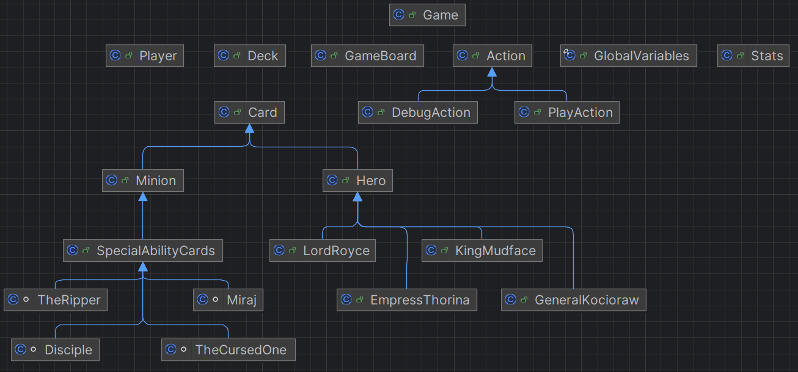

# GwentStone Lite

**Name:** Simion Marina

**Group:** 321CA

This project is a turn-based, two-player card game implemented in Java,
inspired by the games Hearthstone and Gwent. The goal is to reduce the opposing
hero's health to zero while managing resources and maximizing the potential
of each card.

## Features

- **Players**: Two players with their own decks and heroes.
- **Decks**: Each player has a deck of cards with various attributes that can
be drawn from.
- **Heroes**: Different heroes with unique abilities.
- **Actions**: Players can perform various actions such as placing cards,
attacking, and using abilities.
- **Game Board**: A board where the game takes place, including rows for
placing cards.

## Gameplay

### Setup

- Each player starts with a hero and a number of decks, of which one is
selected as the active deck.
- The active deck is shuffled, and each player draws a starting card.
- On the game board, each player has two rows for placing his cards.
- Input is given about the starting player and the actions performed.

### Turns

- At the beginning of each turn, the player draws a card from the deck and
gains an incremental amount of mana.
- The player can then perform various actions, such as placing cards,
attacking and using special abilities.
- Cards are placed on specific rows based on type and abilities; players use
minions and hero abilities strategically to attack and defend.
- The turn ends explicitly when the player decides to pass.

### End Game

- The game ends when one of the heroes' health reaches zero.

## Project Structure

- `src/game`: Contains the main game logic.
- `src/game/heroes`: Contains hero classes.
- `src/fileio`: Contains classes for reading input files.
- `src/main`: Contains the entry point of the application.

## Main Classes

### Game

Manages the game session, including players, decks, actions, and the game
board.

### Player

Represents a player in the game, including their deck, hand, hero, and mana.

### Card

Base class for all card types. Contains common attributes and methods.

### Hero

Represents a hero with unique abilities and features. Inherits from the `Card`
class. Has the four types of heroes as subclasses, each with their own ability.

### Minion

Represents a minion card, which can be a tank or not. Inherits from the `Card`
class. They must be placed on specific rows, and they can attack enemy cards or
the opposing hero.

### SpecialAbilityCards

Inherits from the `Minion` class. Besides their normal attack, they also have a
special ability that can be used once per turn.

### Action

Represents an action that can be performed in the game.
It can either be a debug action or a player action. 

### Stats

Records wins, rounds, and overall game progress.

## Possible Improvements

- A better overall project structure for managing the game elements, maybe 
dividing the classes into more packages, removing some of them,
making them abstract/final
- A better code structure for the game logic, with shorter methods,
usages of enum.

